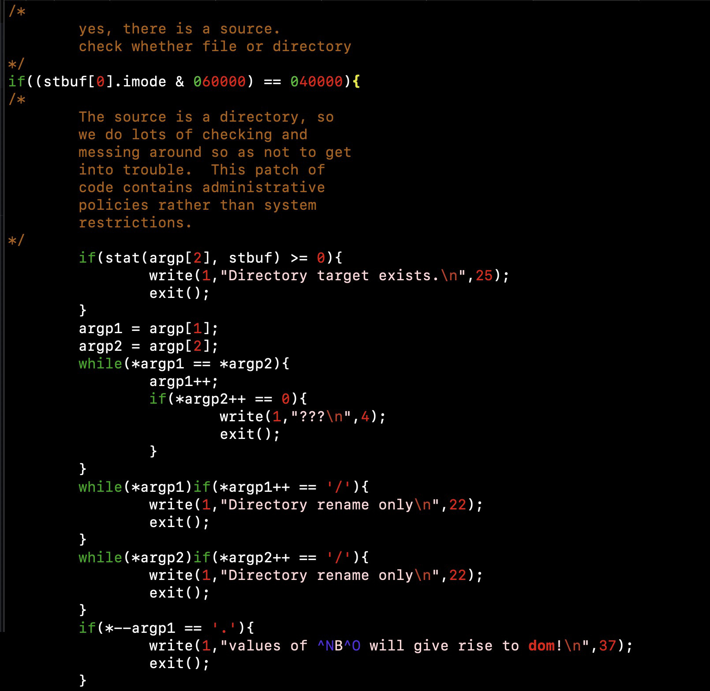

## mv Unix v6: the original source of the famous warning *values of β will give rise to dom!*

As some people know in Unix v6 mv.c could issue a strange error message. Dennis
Ritchie [wrote about it himself](https://www.bell-labs.com/usr/dmr/www/odd.html)
(as well as some other fun things in Unix like the famous comment *`/\* You are
not expected to understand this \*/`* and a funny story about `a.out`).

If you look at the `origin/Research-V6-Snapshot-Development` branch of the [Unix
History Repository](https://github.com/dspinellis/unix-history-repo) you will
find under `usr/source/s2/mv.c` which has the original code. It looks like:

        if(*--argp1 == '.'){
                write(1,"values of ^NB^O will give rise to dom!\n",37);
                exit();
        }

Or better yet the following screenshot which shows the source in its original
form:

As Dennis Ritchie wrote it could also be in the form of:

	write(1,"values of \016B\017 will give rise to dom!\n",37);

but this still has the problems.

## Problems with the v6 mv.c code (for the warning)

There are two problems though in getting this to work. The first one is it no
longer compiles on modern systems as the C standard is much more strict. But
even worse once you fix the code (not hard to do) it no longer works! Instead it
will show only:

> values of B will give rise to dom!

This is really unfortunate but there's a simple fix. Once this is done you can
see the output of the command (as well as how to trigger it):

## So what's the point of this repo ?

The point is to include the original uncompilable code, how to make it
compilable and then how to fix it so that it works on modern systems.

A note that I haven't fixed any other bugs and I haven't cleaned up the compiler
warnings. I could do this but I do not see the point - at least at this time -
and I have other things I'd like to do too.

The file [mv-v6.c](mv-v6.c) is the original file; the file
[mv-v6-compiles.c](mv-v6-compiles.c) is the file with the compilation errors
fixed and the file [mv-v6-beta.c](mv-v6-beta.c) is the fix so that it still
shows the original message!

## Compiling the code

Simply run from the directory:

	make

This should create two executables, one which will show the incorrect message
(`mv-v6`) and the other which will show the correct message (`mv`).

## How to trigger the warning

How to do this? If you don't know C it might be harder to figure out but it's
very simple. The first arg must be a `.` or `..` (specifically the first char
of the first arg must be a `.` and it must be - which of course it is - a
directory) and the second arg must be a non-existent file. Thus the following
invocations will work after compiling the code assuming the file `beta` does not
exist:

	./mv . beta
	./mv .. beta

But the following will not work:

	
	./mv foo bar

if there is no file `foo` or `foo` is not a file or even if `foo` is a directory
and `bar` exists or does not exist.

## A few notes

I only tested one terminal emulator with the output so it's possible it works in
others but I think not because those characters are `!isprint()` and I don't
think they have their original significance (this I am not sure of).

Although you can try out and trigger the original warning the program should not
be used instead of the modern `mv`. This was for fun only.
